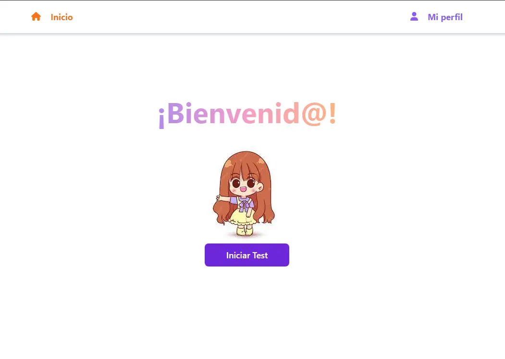
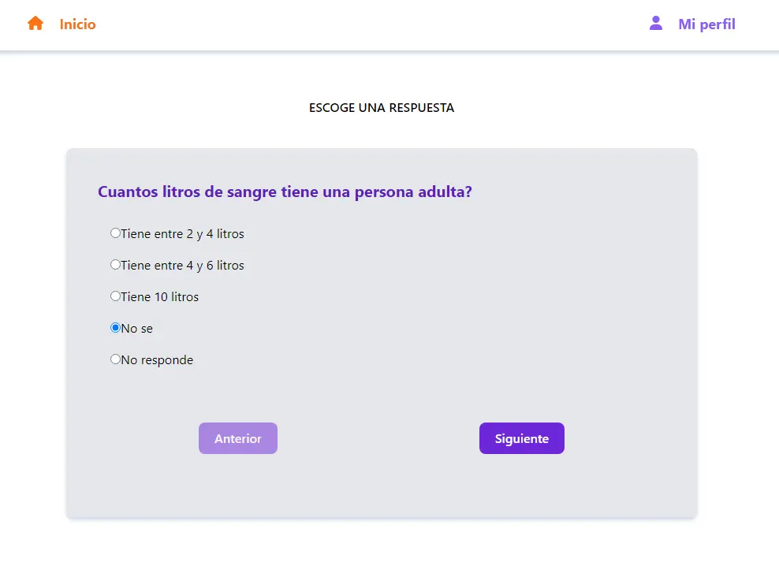
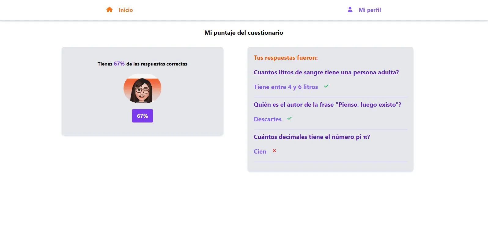

## Trivia

Aplicación tipo Trivia en la que tiene una serie de preguntas y opciones de respuesta, al final del cuestionario muestra en el Perfil el puntaje obtenido y si la respuesta fue correcta o no.

    

Dale un vistazo de la app en [éste corto video](https://www.loom.com/share/715c0995c1dc4a7c9bd3c2a5dd33ae9d?sid=8fa468a5-c0ca-4773-9c94-0426359fe0da).

    

        
    

    

        
    

    

        
    

### Lenguajes de programación usados

- React.js
- TypeScript 
- Tailwind CSS
- Strapi (CMS)

### Creado por

Adriana Maria Ruiz Henao
